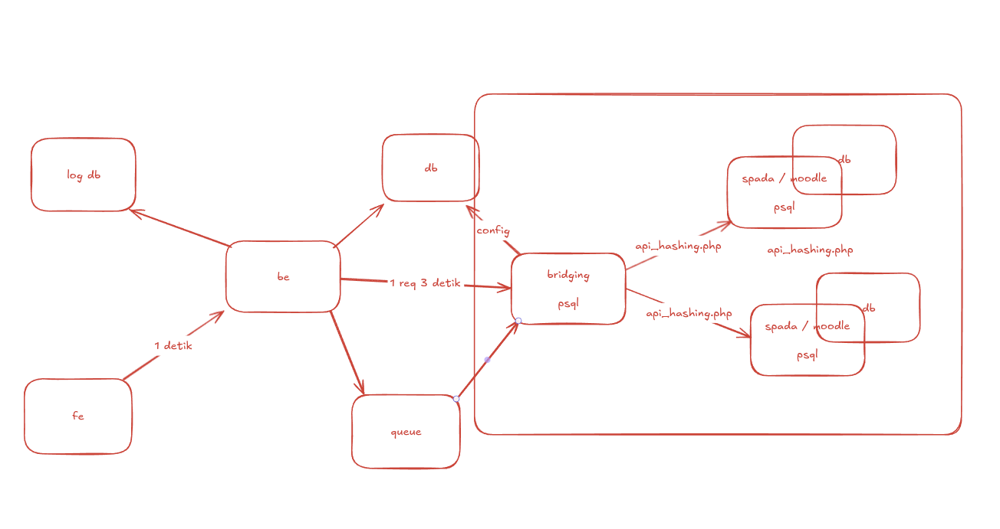

# REST API Boilerplate with Golang & Fiber

This is a simple REST API boilerplate using Golang and Fiber framework.

## Features
- Clean architecture
- CRUD example
- Config file

## Usage
1. Install dependencies: `go mod tidy`
2. Run the server: `go run cmd/main.go`

## Folder Structure
## Database Migration

Untuk melakukan migrasi database, jalankan perintah berikut di terminal:

```fish
go run internal/database/migrate.go
```

Pastikan konfigurasi database sudah benar di `config/config.yaml` sebelum menjalankan migrasi.


## File yang dibutuhkan 

Berikan file /dep_moodle/api_hashing.php ke root folder moodle, akses api_hashing untuk generate password hashing

/**
 * Fungsi ini telah dipindahkan ke modul SPADA untuk melakukan hashing password menggunakan PHP.
 * Silakan gunakan fungsi hashing yang tersedia di SPADA untuk keamanan penyimpanan password.
 * 
 * Catatan:
 * - Pastikan untuk selalu menggunakan algoritma hashing yang aman dan terbaru.
 * - Dokumentasi lebih lanjut dapat ditemukan pada modul SPADA.
 */

## Image Infra
 